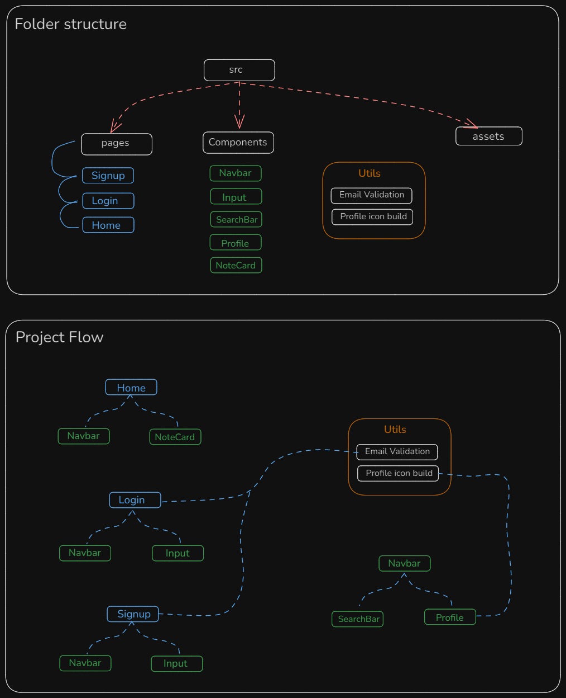

# Full Stack Notes App 

## Features

- Login with validation
- SignUp with validation
- Search Features
- Create Notes
- Date with Note
- Edit Notes
- Delete Notes
- Pin Notes
- Light/dark mode toggle


## Tech Stack
**Frontend:** React, tailwind, reactIcons etc

```
git config core.ignorecase false
```

## Installation

Install with npm -

### Frontend
```bash
  npm create vite@latest ./
  npm Install -D tailwindcss postcss autoprefixer
  npx tailwindcss init -p
  npm i react-router-dom
  npm i react-icons
  npm i react-modal
```

Add this to eslint file -
```
rules : {
    "react/prop-types": "off",
}
```


## Peoject Guide / Project flow

- Folder Structure define files hierarchy
- Project flow define components hierarchy + utils used

##  Folder Structure



